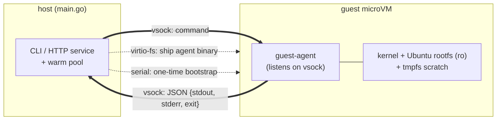

# agent-microvm-sandbox

[](https://github.com/keith991001/agent-microvm-sandbox/actions/workflows/ci.yml)

A minimal **"1 command = 1 microVM"** sandbox, built from scratch in Go on Apple's
**Virtualization.framework**. Each command runs in a brand-new, isolated Linux microVM
that is created, used, and destroyed — a small-scale take on the execution model that
Firecracker popularized and that powers code-execution platforms like E2B, Modal, and
Code Interpreter.

> Built as a learning project to deeply understand how microVM sandboxes achieve fast,
> isolated, disposable command execution.


## Why

AI agents increasingly run untrusted, generated code. Running that code directly on the
host is dangerous; plain containers share the host kernel. A **microVM** gives a real
hardware-virtualization boundary while staying lightweight enough to spin up per command.
This project implements that idea end to end on macOS (Apple Silicon).

## Performance

End-to-end latency for one command (boot → run → return), as the design evolved:

| Stage | Approach | Latency |
|-------|----------|--------:|
| Full Ubuntu boot | systemd + cloud-init | ~125 s |
| Skip the OS boot | `init=/bin/sh` | ~3.7 s |
| Clean channel | vsock + guest agent | ~2.1 s |
| **Warm pool hit** | pre-booted VM pool | **~35 ms** |

## Architecture



- **Host** configures and boots the VM, ships the agent in via **virtio-fs**, and talks to
  it over **vsock** (a host↔VM socket — no networking involved).
- The **guest agent** listens on vsock, runs the command with `bash`, and returns
  `stdout` / `stderr` / `exit code` as JSON, then powers the VM off.
- The **serial console** is used only for a 3-line bootstrap (load drivers, mount the
  share, launch the agent).

## Isolation

| Property | How | 
|----------|-----|
| Can't escape to host | microVM hardware-virtualization boundary |
| No network | no NIC attached → outbound is "Network is unreachable" |
| Can't modify the base image | root filesystem mounted read-only |
| Writes are ephemeral | `tmpfs` on `/tmp`; discarded when the VM dies |
| Can't hang forever | per-command 30 s timeout (whole process group killed) |
| Bounded resources | 2 vCPU / 1 GiB per VM |

## Requirements

- macOS on **Apple Silicon** (uses Virtualization.framework)
- Go (1.22+), Xcode Command Line Tools
- `qemu` (only for `qemu-img`, to convert the disk image): `brew install qemu`

## Setup (download / build the VM assets)

VM assets live in `vm/` and are **git-ignored** (large, regenerable).

```bash
mkdir -p vm
base=https://cloud-images.ubuntu.com/releases/noble/release

# kernel (must be uncompressed for Virtualization.framework) + initrd
curl -fL -o vm/vmlinuz "$base/unpacked/ubuntu-24.04-server-cloudimg-arm64-vmlinuz-generic"
curl -fL -o vm/initrd  "$base/unpacked/ubuntu-24.04-server-cloudimg-arm64-initrd-generic"
gunzip -c vm/vmlinuz > vm/vmlinux

# root filesystem: qcow2 cloud image -> raw (Virtualization.framework needs raw)
curl -fL -o vm/noble.img "$base/ubuntu-24.04-server-cloudimg-arm64.img"
qemu-img convert -O raw vm/noble.img vm/rootfs.raw
qemu-img resize vm/rootfs.raw 8G
```

## Build

A Virtualization.framework binary must be code-signed with the virtualization
entitlement (see `vz.entitlements`).

```bash
# guest agent: static linux/arm64 binary, shared into the VM via virtio-fs
GOOS=linux GOARCH=arm64 CGO_ENABLED=0 go build -o share/agent ./guest-agent

# host binary, signed with the virtualization entitlement
go build -o microvm .
codesign --entitlements vz.entitlements -s - microvm
```

## Usage

One-shot:

```bash
./microvm "uname -a"
./microvm "echo hi; whoami; nproc"
```

HTTP service with a warm pool:

```bash
./microvm -serve -pool 2 -addr :8080
curl -s :8080/run -d '{"cmd":"echo hello"}'
# {"stdout":"hello\n","stderr":"","exit":0}
```

## How it works (design notes)

A few decisions and gotchas worth calling out:

- **`init=/bin/sh`** — running a shell as PID 1 skips systemd/cloud-init entirely, cutting
  boot from ~125 s to a couple of seconds. The full Ubuntu userland (bash, python, …) is
  still available from the mounted root.
- **Read-only root + `rootflags=noload`** — the base image stays pristine, and ext4 is
  mounted read-only without replaying a dirty journal.
- **vsock over serial** — the command protocol uses a dedicated host↔VM socket, so output
  is structured (separate stdout/stderr/exit) instead of being scraped from a noisy
  serial console.
- **Agent delivery via virtio-fs** — the agent binary is shared from the host rather than
  baked into the (read-only, hard-to-edit on macOS) ext4 image.
- **Warm pool** — pre-booting VMs and connecting on demand removes the cold-start cost;
  pool hits return in tens of milliseconds.
- **Process-group timeout** — a per-command deadline kills the whole process group, so a
  runaway grandchild (e.g. `sleep`) can't keep the pipes (and the call) open.

## Limitations

- Learning project, not production-grade.
- Apple Silicon / macOS only.
- Read-only root + ephemeral `tmpfs`; no persistent writable layer (by design).
- Single command per VM; no streaming output.

## Status

Implemented incrementally; every stage leaves a runnable state:
sign/entitlement pipeline → boot Linux → 1-command MVP → vsock channel → isolation →
warm pool → HTTP service. All done.
