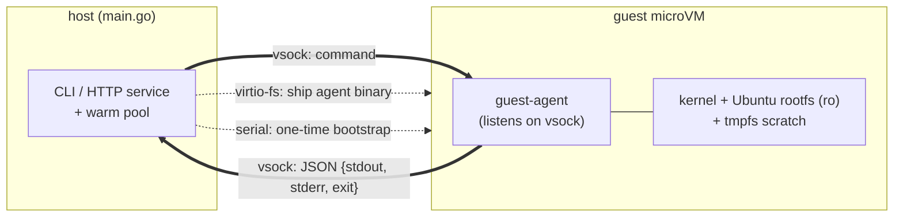

# microVM sandbox — incremental plan & results

**Concept**: build a "1 command = 1 microVM" execution model in Go on top of macOS's
Virtualization.framework (a small-scale take on the model Firecracker popularized). Each
command boots a fresh, disposable ARM64 Linux microVM, runs the command, and tears it down.

**Stack**: Go + Virtualization.framework (`Code-Hex/vz`) / ARM64 Linux guest / runs entirely
on a local Apple Silicon Mac.

Work was split so that **every stage ends in a runnable, demoable state** (incremental
development). All of **S0–S7 are implemented**.

## Stages (all complete)

| Stage | Goal | Runnable state | Status |
|-------|------|----------------|--------|
| **S0** | build → sign → entitlement pipeline | signed binary runs, virtualization entitlement verified | ✅ |
| **S1** | first Linux VM boot | boot kernel + initrd, get a shell on the serial console | ✅ |
| **S2** | boot driven from code | VM configured and started programmatically | ✅ |
| **S3** | 1 command = 1 microVM (MVP) | `microvm "<cmd>"` → boot → run → output + exit code → destroy | ✅ |
| **S4** | clean output channel | vsock + guest agent; stdout/stderr/exit as JSON | ✅ |
| **S5** | isolation hardening | no network / read-only root / ephemeral tmpfs / command timeout | ✅ |
| **S6** | warm pool | pre-booted VM pool removes cold start | ✅ |
| **S7** | service | HTTP service: `POST /run {"cmd":...}` | ✅ |

## Measured: boot-optimization progression (end-to-end, one command)

| Approach | Latency |
|----------|--------:|
| Full Ubuntu boot (systemd + cloud-init) | ~125 s |
| Skip the OS boot (`init=/bin/sh`) | ~3.7 s |
| Clean channel (vsock) | ~2.1 s |
| **Warm pool hit** | **~35 ms** |

## Isolation (verified)

| Property | How | Verification |
|----------|-----|--------------|
| Can't escape to host | microVM hardware-virtualization boundary | by design |
| No network | no NIC attached | outbound → "Network is unreachable" |
| Can't modify the base image | root mounted read-only | writing `/etc` → "Read-only file system" |
| Writes are ephemeral | `tmpfs` on `/tmp` | gone in the next fresh VM |
| Can't hang forever | 30 s command timeout (whole process group killed) | `sleep 60` → exit 124 at ~30 s |
| Bounded resources | 2 vCPU / 1 GiB per VM | — |

## Architecture

## Design notes

- **`init=/bin/sh`** skips systemd/cloud-init, cutting boot from ~125 s to a few seconds
  (the full Ubuntu userland is still available from the mounted root).
- **vsock + JSON** gives structured results (separate stdout/stderr/exit) instead of
  scraping a noisy serial console.
- **virtio-fs** ships the agent binary into the guest (avoids needing to write into the
  read-only, hard-to-edit-on-macOS ext4 image).
- **Warm pool** pre-boots VMs; pool hits respond in tens of milliseconds.
- The command timeout kills the whole process group, so a grandchild process can't keep
  the pipes (and the call) open.

## Repository

https://github.com/keith991001/agent-microvm-sandbox
